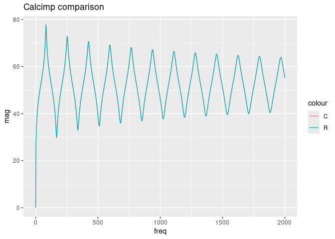

# test_calcimp_manual


``` r
library(tidyverse)
library(calcimp)
```

## simple test.men

orginal C application result for [test.men](../sample/test.men) is saved
as [test.imp](../sample/test.imp)

``` r
ref <- read_csv("../sample/test.imp", show_col_types = FALSE)
```

Do calcimp for test.men with default parameters.

``` r
rslt <- calcimp("../sample/test.men")
```

Compare two.

``` r
ggplot() + 
  geom_line(aes(x = freq, y = mag, color = "C"), data = ref) + 
  geom_line(aes(x = freq, y = mag, color = "R"), data = rslt) + 
  labs(title = "Calcimp comparison")
```



``` r
ref %>% head()
```

| freq | imp.real |  imp.imag |      mag |
|-----:|---------:|----------:|---------:|
|  0.0 | 0.000000 |   0.00000 |  0.00000 |
|  2.5 | 3.202246 |  22.47610 | 27.12169 |
|  5.0 | 4.791645 |  42.93472 | 32.70993 |
|  7.5 | 6.079258 |  63.21613 | 36.05654 |
| 10.0 | 7.241407 |  83.59688 | 38.47627 |
| 12.5 | 8.355127 | 104.24487 | 40.38890 |

``` r
rslt %>% as_tibble() %>% head()
```

| freq |     real |      imag |      mag |
|-----:|---------:|----------:|---------:|
|  0.0 | 0.000000 |   0.00000 |  0.00000 |
|  2.5 | 3.202246 |  22.47610 | 27.12169 |
|  5.0 | 4.791645 |  42.93472 | 32.70993 |
|  7.5 | 6.079258 |  63.21613 | 36.05654 |
| 10.0 | 7.241407 |  83.59688 | 38.47627 |
| 12.5 | 8.355127 | 104.24487 | 40.38890 |

Same! Perfect!
